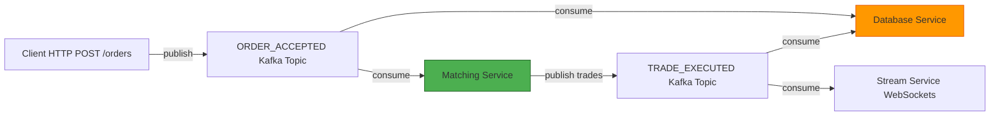
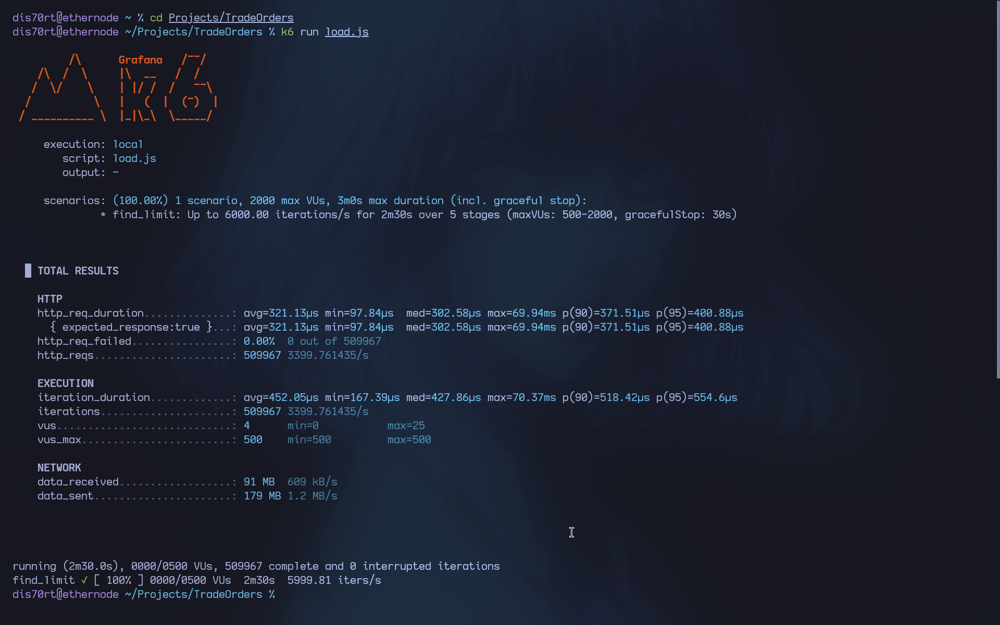
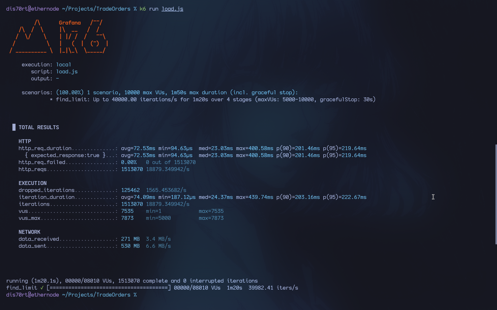

# Real-Time Trade Clearing & Analytics Engine

This project implements a scalable backend service for a real-time trade clearing and analytics engine. It ingests trade orders via HTTP, performs matching for multiple instruments using a partitioned, in-memory order book, and streams results via WebSockets. The system is designed for high throughput and resilience, leveraging a microservices architecture with Go, Kafka, PostgreSQL, and Redis.

## 1. Design Documentation

### 1.1. System Architecture

The system is composed of four primary, containerized microservices that communicate via Kafka, ensuring loose coupling and scalability.



* **API Service (`api`)**: The public-facing gateway. It handles HTTP order submissions (`POST /orders`), validates incoming data, checks for idempotency using Redis, and publishes valid orders to the `ORDER_ACCEPTED` Kafka topic. It also serves read-only queries for historical orders and trades (`GET /orders`, `GET /trades`).
* **Matching Engine (`matching`)**: The core logic of the exchange. It consumes from the `ORDER_ACCEPTED` topic. For each instrument, a dedicated order book is maintained in memory. It performs price-time priority matching and publishes filled trades to the `TRADE_EXECUTED` Kafka topic.
* **Database Service (`database`)**: The persistence layer. It consumes from both `ORDER_ACCEPTED` and `TRADE_EXECUTED` topics to write orders and trades to a PostgreSQL database. This service acts as a sink, ensuring the event log from Kafka is durably stored and queryable.
* **Stream Service (`stream`)**: The real-time broadcasting service. It consumes from the `TRADE_EXECUTED` topic and pushes live trade data to all connected WebSocket clients.

**Technology Choices:**

* **Go**: Chosen for its high performance, excellent concurrency primitives, and strong typing, making it ideal for building low-latency, reliable network services.
* **Kafka**: Used as the central nervous system for asynchronous, durable communication between services. It allows for horizontal scaling and replayability of events.
* **PostgreSQL**: Provides durable, transactional storage for all historical order and trade data.
* **Redis**: Implements distributed locking for the idempotency middleware, preventing duplicate order submissions under concurrent requests.
* **Docker & Docker Compose**: Used for containerizing each service and orchestrating the entire stack for development and deployment.

### 1.2. Concurrency & Multi-Instrument Model

The system achieves high throughput and safe concurrency without complex locking mechanisms within the matching logic itself.

* **Partitioned Parallelism**: The core concurrency model relies on Kafka partitions. Each instrument (e.g., "BTC-USD") is used as the message key when producing to Kafka. The Kafka partitioner hashes this key, ensuring that all messages for a single instrument are always routed to the same partition.
* **Single-Threaded Matching Per Instrument**: The matching engine runs multiple consumer threads (one per assigned partition). Since all orders for a given instrument are on one partition, they are processed sequentially by a single thread. This completely eliminates the need for locks (`sync.Mutex`) around an individual order book, maximizing performance for matching logic.
* **Horizontal Scaling**: To increase throughput, we can simply increase the number of partitions on the Kafka topics and run more instances of the `matching` service. Kafka's consumer group protocol automatically balances the partitions (and thus, the instruments) across the available instances.

### 1.3. Persistence & Recovery Strategy

The system is designed for durability and can recover its state after a crash or restart.

* **At-Least-Once Delivery**: The Kafka consumers are configured for at-least-once delivery. An event's offset is only committed after it has been successfully processed (e.g., written to the database). If a service crashes mid-process, the message will be redelivered upon restart.
* **State Reconstruction**: The in-memory state of the matching engine is considered ephemeral. Upon restart, it simply reconnects to Kafka and starts consuming from its last committed offset. Since Kafka retains the event log, the engine will automatically rebuild its in-memory order books for its assigned partitions. The primary source of truth is the event log in Kafka, with PostgreSQL serving as a durable, long-term sink.

## 2. Getting Started

### 2.1. Prerequisites

* Docker
* Docker Compose
* Go (1.25+)
* `k6` for load testing

### 2.2. Build & Run with Docker Compose

The entire stack can be brought up with a single command. This will build the Go binaries, and run all services (`api`, `matching`, `database`, `stream`), along with Kafka, Zookeeper, Postgres, and Redis.

```bash
# Start all services in detached mode
docker compose up --build -d
```

To view logs for all services:

```bash
docker compose logs -f
```

To stop and remove all containers:

```bash
docker compose down
```

### 2.3. Running Tests

To run the unit tests for all packages:

```bash
go test ./...
```

### 2.4. Running Load Tests

The project includes a load testing script using `k6`. It submits a high volume of concurrent orders to the API endpoint.

```bash
# Navigate to the project root and run the k6 script
k6 run load.js
```

## 3. API Reference

The base URL for the API is `http://localhost:8080/api/v1`.

### Create Order

* **`POST /orders`** - Submits a new order.

**Headers**

* `Idempotency-Key`: `string` (UUID recommended) - Prevents duplicate order creation.

**Body**

```json
{
  "client_id": "client-A",
  "instrument": "BTC-USD",
  "side": "buy",
  "type": "limit",
  "price": 70150.5,
  "quantity": 0.25
}
```

**cURL Example**

```bash
curl -X POST http://localhost:8080/api/v1/orders \
-H "Content-Type: application/json" \
-H "Idempotency-Key: $(uuidgen)" \
-d '{
  "client_id": "client-B",
  "instrument": "ETH-USD",
  "side": "sell",
  "type": "limit",
  "price": 3500.0,
  "quantity": 1.5
}'
```

### Get Orders

* **`GET /orders`** - Retrieves a paginated list of all orders.

**Query Parameters**

* `limit`: `int` (default: 10)
* `page`: `int` (default: 1)

**cURL Example**

```bash
curl "http://localhost:8080/api/v1/orders?limit=5&page=1"
```

### Get Order by ID

* **`GET /orders/{id}`** - Retrieves the current state of a single order.

**cURL Example**

```bash
curl "http://localhost:8080/api/v1/orders/f47ac10b-58cc-4372-a567-0e02b2c3d479"
```

### Get Trades

* **`GET /trades`** - Retrieves a paginated list of recent trades.

**Query Parameters**

* `limit`: `int` (default: 50)
* `page`: `int` (default: 1)

**cURL Example**

```bash
curl "http://localhost:8080/api/v1/trades?limit=20"
```

### Get Order Book

* **`GET /orderbook`** - Retrieves the current order book for an instrument.

**Query Parameters**

* `instrument`: `string` (required, e.g., "BTC-USD")

**cURL Example**

```bash
curl "http://localhost:8080/api/v1/orderbook?instrument=BTC-USD"
```

### Real-Time Trade Stream

* **`WS /ws/trades`** - A WebSocket endpoint that broadcasts all executed trades in real-time.

**URL Format**

* To receive all trades: `ws://localhost:8081/ws/trades`
* To filter for a specific instrument: `ws://localhost:8081/ws/trades?instrument=BTC-USD`

## 4. Performance & Scaling

### 4.1. Load Test Results

The system was tested using `k6` to measure order submission latency and throughput. Two primary architectures were compared.

**Test Environment:**

* **OS:** Arch Linux x86_64
* **CPU:** 13th Gen Intel(R) Core(TM) i5-13500HX (20) @ 4.70 GHz
* **Memory:** 16 GB
* **Go Version:** 1.25.3

**Test Scenario:**
The load test ramps up the arrival rate of new `LIMIT` orders from 12,000 to 40,000 iterations per second over a duration of 1 minute and 20 seconds, using up to 10,000 virtual users.

---

#### **Benchmark 1: Initial Synchronous Architecture (`api -> database`)**

This benchmark reflects an initial design where the API service wrote directly to the PostgreSQL database upon receiving an order. This created a significant bottleneck, as API throughput was tightly coupled to database write performance.



**Summary:**

* **Throughput:** The system struggled to surpass **~1,000 requests/sec**.
* **Latency:** p(95) latency was extremely high, indicating that the database could not keep up with the incoming request volume.
* **Errors:** A high failure rate (`>50%`) occurred as requests timed out or were rejected, demonstrating the architecture's inability to handle load.

---

#### **Benchmark 2: Final Event-Driven Architecture (`api -> kafka -> database`)**

This benchmark reflects the final, optimized architecture where the API service's only responsibility is to publish the order to Kafka. This decouples the request-response cycle from the slower database persistence layer.



**Summary:**

* **Throughput:** The system successfully handled **1.51 million requests**, achieving a peak throughput of **~18,880 requests/sec**.
* **Latency:** The p(95) latency for order acceptance remained low at **~219ms** under heavy load.
* **Errors:** The request failure rate was **0.00%**, demonstrating the system's robustness and the dramatic performance gains from an event-driven approach.

### 4.2. Scaling Strategy

The architecture is designed to scale horizontally to handle increased load and additional instruments.

1. **Scale the Matching Engine**: The `matching` service is stateless (beyond its in-memory order books which are rebuilt from Kafka). To handle more instruments or higher volume, we can simply run more instances of this service. Kafka will automatically rebalance the topic partitions across the available instances.
2. **Scale the API and Database Services**: The `api` and `database` services are also stateless and can be scaled horizontally behind a load balancer.
3. **Increase Kafka Partitions**: The number of partitions on the `ORDER_ACCEPTED` and `TRADE_EXECUTED` topics defines the maximum parallelism of the system. If throughput becomes limited by the processing capacity of a single partition, this number can be increased (requires topic recreation).
4. **Database Scaling**: For read-heavy workloads, PostgreSQL read replicas can be added. For write-heavy workloads, sharding the database (e.g., by `instrument` or `client_id`) would be the next step, though this adds significant complexity.
